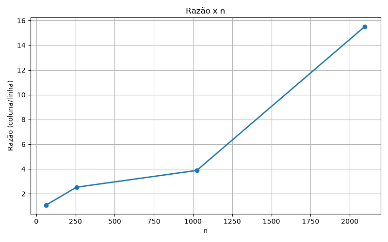

# Testes

## 64

| execução | coluna (s)  | linha (s)   |
| :------: | ----------- | ----------- |
| 1        | 0.000006664 | 0.000006538 |
| 2        | 0.000007799 | 0.000010880 |
| 3        | 0.000007486 | 0.000029364 |
| **4 (mediana)** | **0.000003580** | **0.000003280** |
| 5        | 0.000029596 | 0.000007289 |
| 6        | 0.000007599 | 0.000006992 |

## 256

| execução | coluna (s)  | linha (s)   |
| :------: | ----------- | ----------- |
| 1        | 0.000338440 | 0.000115563 |
| 2        | 0.000317913 | 0.000116374 |
| 3        | 0.000309135 | 0.000141833 |
| **4 (mediana)** | **0.000258998** | **0.000102496** |
| 5        | 0.000285165 | 0.000118246 |
| 6        | 0.000056732 | 0.000041275 |

## 1024

| execução | coluna (s)  | linha (s)   |
| :------: | ----------- | ----------- |
| 1        | 0.008017854 | 0.002009032 |
| 2        | 0.001583052 | 0.000454766 |
| 3        | 0.008092710 | 0.002055573 |
| **4 (mediana)** | **0.007677833** | **0.001977085** |
| 5        | 0.008197111 | 0.001879044 |
| 6        | 0.008227423 | 0.002462193 |

## 4096

| execução | coluna (s)  | linha (s)   |
| :------: | ----------- | ----------- |
| 1        | 0.109968413 | 0.007497248 |
| 2        | 0.124746168 | 0.010568915 |
| 3        | 0.099518830 | 0.007420089 |
| **4 (mediana)** | **0.105444196** | **0.006797289** |
| 5        | 0.094336473 | 0.006847184 |
| 6        | 0.095307667 | 0.007483992 |

# Tabela

| n    | coluna/linha |
| ---- | ------------ |
| 64   | 1,091463415  |
| 256  | 2,526908367  |
| 1024 | 3,883410678  |
| 2096 | 15,512683954 | 

# Gráfico

Salto grande entre 1024 e 4096 porque a matriz deixa de caber em L3. Acesso a coluna puxa nova linha de cache inteira, mas usa só um elemento. Aesso a linha continua sequencial, então a perda é menor.

| Cache | Total    | Instâncias | Por instância |
| ----- | -------- | :--------: | -------------- |
| L1d   | 192 KiB  | 6          | 32 KiB         |
| L1i   | 192 KiB  | 6          | 32 KiB         |
| L2    | 1,5 MiB  | 6          | 256 KiB        |
| L3    | 12 MiB   | 1          | 12 MiB         |

